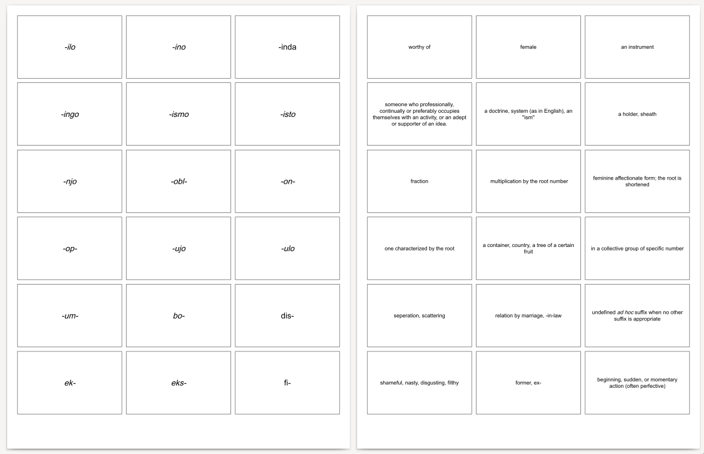

# AnkiPrint

[Live App Here](https://evidlo.github.io/ankiprint)

Convert an Anki deck into a printable grid of cards.  

Create a link to a public Anki deck by appending `?url=https://example.com/my_deck.apkg` in the address bar.

Disclaimer: This mini-project was almost entirely LLM-generated